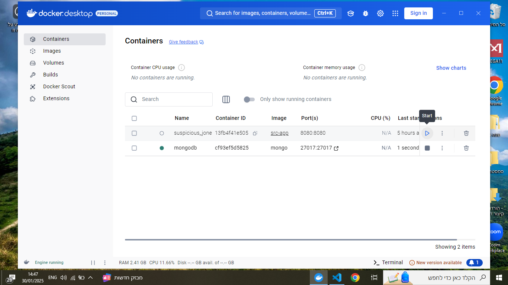
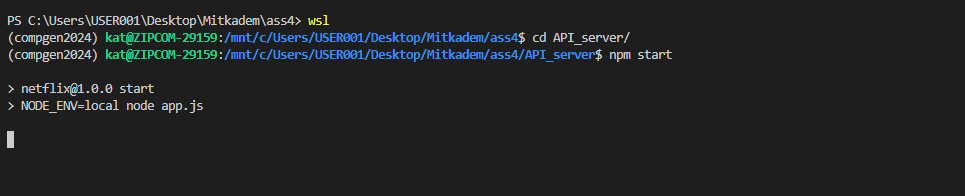
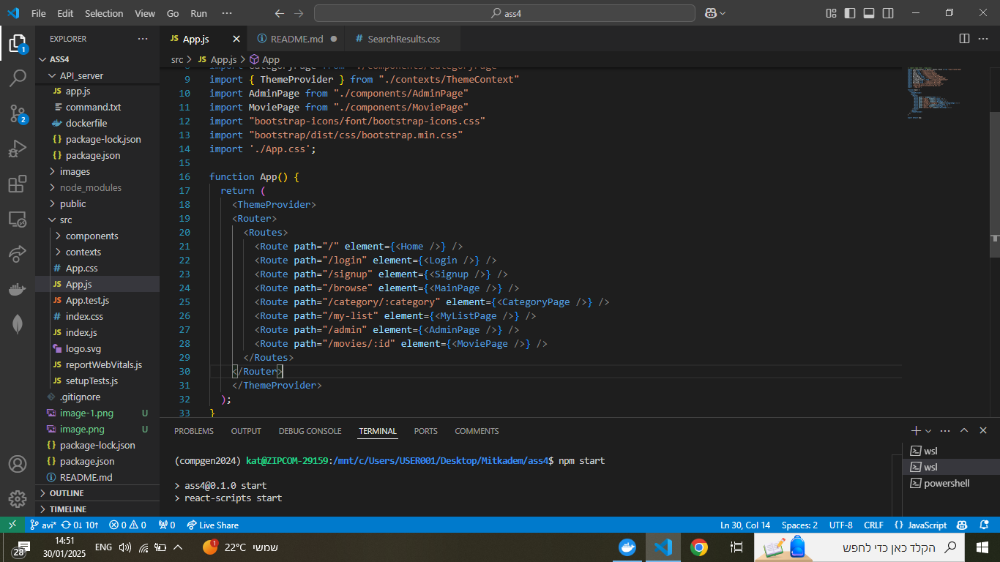
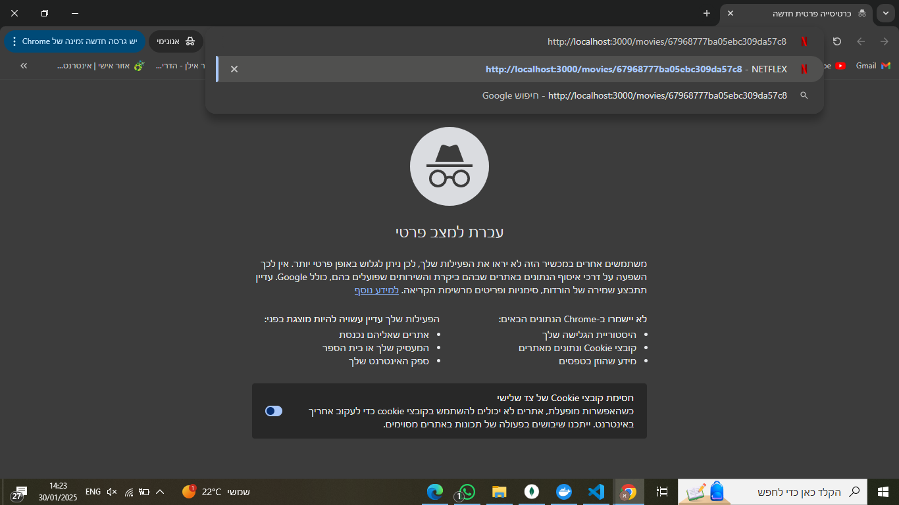

#ass4

cd API_server 

npm start

split terminal

npm start

run the recommend server from ass2

run the API server from ass3

run the web server

search

light mode

now we login as an admin(signup before) and modify/create/delete movies and category

craete

edit

and indeed the drama category disapeared

delete

create movie

edit

delete

recommend

try to see a movie from a link whithout login

